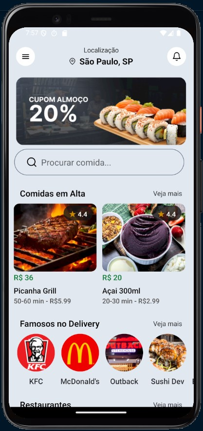
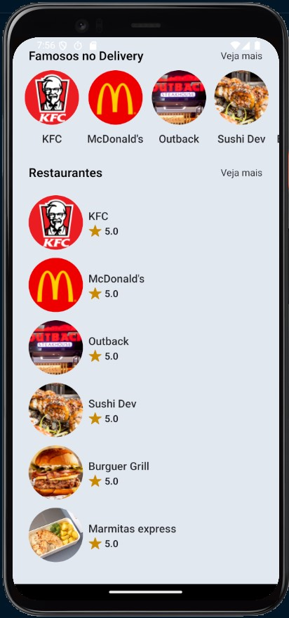

# DeliveryApp 📱🚚

This is a **React Native** project for a delivery application prototype. The goal of the project is to provide a visual interface for a delivery app, without backend functionalities or real delivery operations.

## 📋 Table of Contents

- [About the Project](#about-the-project)
- [Technologies Used](#technologies-used)
- [Installation](#installation)
- [Project](#project)

## About the Project

The **DeliveryApp** is a visual prototype of a delivery application. It allows users to browse a list of restaurants and some foods.

This project was created to showcase what a delivery app interface would look like.

## Technologies Used

The project was developed using the following technologies:

- **React Native**: Framework for building mobile apps using React.
- **Typescript**: Programming language used for app development.
- **Expo**: Toolchain to ease development and testing of React Native apps.
- **Tailwind**: For component styling.

## Installation

Follow the steps below to run the project locally:

1. **Clone the repository**:

   ```bash
   git clone https://github.com/jvittor1/Delivery-App.git
   ```

2. **Install dependencies**:

   ```bash
   cd Delivery-App
   npm install
   ```

3. **Start API**:
   ```bash
   npx json-server db.json
   ```
4. **Run Application**:
   ```bash
   npm start
   ```

## Project

### Here’s how the app looks:

<p align="center">
  
  
</p>
